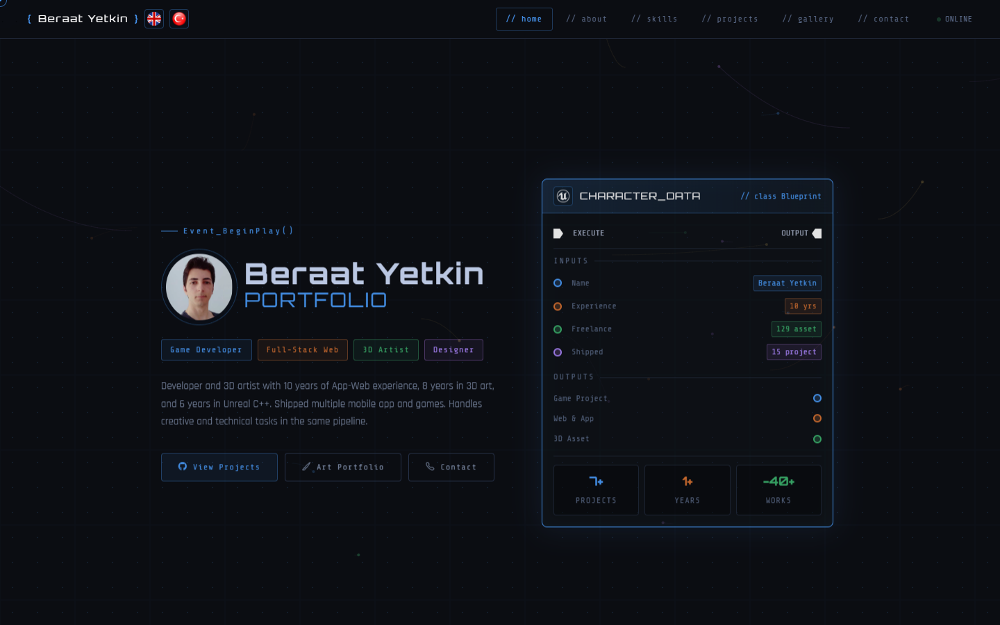
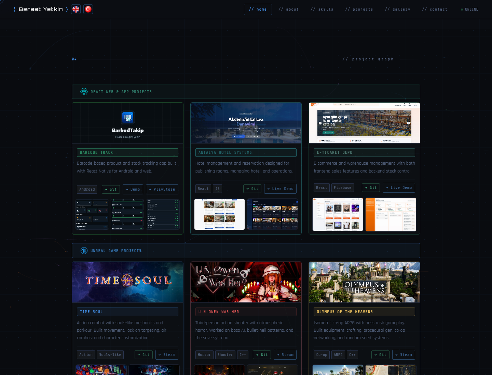

# Beraat Yetkin • Portfolio & Enterprise Projects Showcase
> Full-Stack Web Developer • Unreal Engine C++ Game Developer • 3D Technical Artist

[](https://github.com/kubrvk/portfolio)
[](LICENSE)
[](https://unrealengine.com)
[](https://developer.mozilla.org)
[](https://threejs.org)

---

## Previews

### 1. Developer Profile & Hero Workstation
Unreal Engine Blueprint-style interactive identity card, skill matrix, and dynamic particle network background:


### 2. Live Projects Showcase
Production-grade enterprise SaaS platforms, 3D WebGL studios, and Unreal Engine C++ games:


---

## Live Enterprise SaaS & 3D Ecosystem

The portfolio showcases six purpose-built web applications, each developed with specialized industry architectures and deployed live to Firebase Hosting:

| Project | Industry & Architecture | Key Capabilities | Live Demo | Repository |
| :--- | :--- | :--- | :---: | :---: |
| **TaskFlow.Ops** | Agile & DevOps Task Board (Linear / Jira) | 4-column Kanban, prominent task deletion, dynamic sprint recalculation, PostgreSQL audit logging, session persistence. | [taskflowops.web.app](https://taskflowops.web.app) | [GitHub](https://github.com/kubrvk/TaskFlow) |
| **FieldOps** | Industrial Dispatcher Console (Field Service) | Two-column split-screen console, live GPS coordinates, ISO-9001 checklist verification, order deletion, offline SQLite queue. | [fieldopsapp.web.app](https://fieldopsapp.web.app) | [GitHub](https://github.com/kubrvk/FieldOps) |
| **FinFlow ERP** | Corporate Finance & E-Invoicing (SAP / NetSuite) | Two-panel Wall Street login, live central bank FX rates, outbox invoice deletion, automatic VAT and trial balance reconciliation. | [finflow-erp.web.app](https://finflow-erp.web.app) | [GitHub](https://github.com/kubrvk/FinFlow-ERP) |
| **DocVault DMS** | Cryptographic Cloud Archive (Google Drive / Box) | Zero-Knowledge cyber gateway, live S3 storage quota meter, SHA-256 integrity verification, safe document purging. | [docvaultdms.web.app](https://docvaultdms.web.app) | [GitHub](https://github.com/kubrvk/DocVault-DMS) |
| **ServisPort** | Public GovTech Service Desk (Civic Platform) | Municipal crest banner, Redis 7.2 distributed lock pool (SETNX), 4-step appointment booking wizard, application cancellation. | [servisport.web.app](https://servisport.web.app) | [GitHub](https://github.com/kubrvk/ServisPort) |
| **3DInteractJS** | PBR 3D Material Studio (WebGL 2.0 / CAD) | Immediate access CAD workbench, Three.js physically based rendering (PBR), 6 model geometries, HDRI lighting moods, floating HUD. | [3dinteract.web.app](https://3dinteract.web.app) | [GitHub](https://github.com/kubrvk/3DInteractJsScript) |

---

## Technical Competencies

- Game Development: Unreal Engine 5, C++, Blueprint Visual Scripting, Gameplay Framework, AI Controller, Animation State Machines, Multiplayer Networking.
- Web Engineering: Modern ES6+ JavaScript, TypeScript, React, React Native, Node.js, HTML5 Canvas, CSS3 Grid/Flexbox.
- 3D & Graphics: Three.js, WebGL 2.0, Blender, PBR Shading, Real-time Lighting, CAD Tools.
- Cloud & Data: Firebase Hosting, Redis Distributed Locks, PostgreSQL, SQLite, AWS S3 simulation.
- Architecture Discipline: Zero external runtime dependencies, reactive local state management (localStorage), bilingual (EN / TR) modular structure.

---

## Directory Structure

```
portfolio/
├── index.html              # Main portfolio application
├── docs/                   # High-resolution showcase screenshots
│   ├── preview-hero.png    # Hero section preview
│   └── preview-projects.png # Projects showcase preview
└── README.md               # Portfolio documentation
```

---

## Getting Started

1. Clone the repository:
   ```bash
   git clone https://github.com/kubrvk/portfolio.git
   cd portfolio
   ```
2. Open `index.html` directly in your browser:
   ```bash
   start index.html
   ```
3. Alternatively, serve with any local HTTP server:
   ```bash
   npx serve .
   ```

---

## Author & Contact

Beraat Yetkin
- GitHub: [@kubrvk](https://github.com/kubrvk)
- Portfolio: [Beraat Yetkin Portfolio](https://github.com/kubrvk/portfolio)
